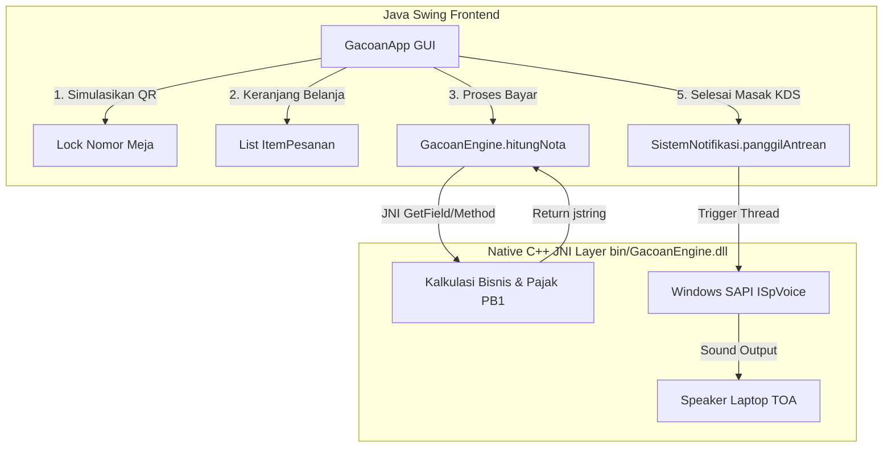

# DEVELOPER DOCUMENTATION & ARCHITECTURE GUIDE
**Sistem Self-Ordering & Kitchen Display System (KDS) Mie Gacoan - JNI Hybrid**

Dokumentasi ini disusun khusus sebagai acuan teknis berstandar tinggi bagi pengembang atau asisten kecerdasan buatan (AI coding agent seperti Vibe Code) agar dapat langsung memahami arsitektur, integrasi JNI native, sistem visual, dan alur kompilasi aplikasi ini secara instan.

---

## 1. IKHTISAR SISTEM (SYSTEM OVERVIEW)

Aplikasi ini menggunakan arsitektur **Hybrid Java-C++** terintegrasi menggunakan **Java Native Interface (JNI)** pada platform Windows 64-bit:
* **Frontend & App State (Java Swing):** Mengelola siklus hidup visual GUI, interaksi pemesanan mandiri pelanggan, pemindaian QR Meja, pengelolaan daftar belanja (keranjang), serta kartu tugas kru masak di Kitchen Display System (KDS).
* **Backend & Native Computation (C++ Dynamic DLL via JNI):** Melakukan kalkulasi finansial bisnis progresif Mie Gacoan, menyusun ASCII art struk nota POS belanja terformat, serta memicu panggilan audio Text-to-Speech (TTS) native Windows SAPI secara asinkron.

---

## 2. ARSITEKTUR KELAS BERORIENTASI OBJEK (OOP)

Aplikasi ini mengimplementasikan minimal 5 kelas utama yang saling berkolaborasi erat:

### A. Lapisan Model Java (`gacoan/` package)
1. **`Menu.java`:** Data model representasi hidangan.
   * *Fields:* `String id`, `String nama`, `double hargaDasar`, `String kategori` (`Makanan`, `Dimsum`, `Minuman`).
2. **`ItemPesanan.java`:** Data model porsi belanja hidangan kustom.
   * *Fields:* `Menu menu` *(Dependency)*, `int kuantitas`, `int levelPedas` (0 - 8), `String catatan`.
3. **`TransaksiPesanan.java`:** Model transaksi utama (Nota).
   * *Fields:* `String idNota` (Format: `GCN-YYYYMMDD-HHMMSS`), `int nomorMeja`, `List<ItemPesanan> daftarBelanja` *(Dependency)*, `String status` (`PENDING`, `DIPROSES`, `SELESAI`).
   * *Methods:* `tambahItem(ItemPesanan)` untuk memanipulasi keranjang belanja.

### B. Lapisan JNI Binding & Validasi
4. **`GacoanEngine.java`:** Deklarasi pemetaan native DLL untuk kalkulasi keuangan.
   * *Methods:* `public native String hitungNota(TransaksiPesanan transaksi);`
   * *Static Block:* Memuat `GacoanEngine.dll` secara dinamis.
5. **`SistemNotifikasi.java`:** Deklarasi pemetaan native DLL asinkron untuk Audio TTS.
   * *Methods:* `public static native void panggilAntrean(int nomorMeja);`
6. **`PreFlightCheck.java`:** Engine diagnostik lingkungan kerja Windows sebelum inisialisasi GUI.
   * *Verifikasi:* Keberadaan & versi JDK, kompatibilitas compiler MinGW 64-bit (`g++` on PATH), serta pengujian muat JNI DLL (`GacoanEngine.dll`).

### C. Lapisan Visual GUI
7. **`GacoanApp.java`:** Jantung antarmuka Swing premium.
   * Mengatur interaksi visual katalog, floating panel QR scanner, sinkronisasi keranjang belanja, serta antrean KDS Dapur.

---

## 3. MEKANISME NATIVE JNI & C++ LAYER (`GacoanEngine.cpp`)

Pustaka native C++ memproses objek Java secara dinamis tanpa bantuan library pihak ketiga:

### A. Parsing Struktur List Java di C++
Dalam fungsi native `Java_gacoan_GacoanEngine_hitungNota`, C++ melakukan refleksi memori (reflection) atas objek Java:
1. Mengambil class `TransaksiPesanan` -> mengakses field `idNota` dan `nomorMeja`.
2. Memanggil method `getDaftarBelanja()` untuk mendapatkan penampung list `java.util.List`.
3. Melakukan iterasi dinamis atas elemen list menggunakan ukuran `size()` dan pengambil indeks `get(i)`.
4. Untuk setiap objek `ItemPesanan`, C++ mengekstrak data hidangan `Menu` (nama, kategori, harga dasar, kuantitas, level pedas, dan catatan).

### B. Logika Bisnis Finansial Gacoan di C++
* Jika kategori = `"Makanan"` (Mie Hompimpa / Mie Gacoan):
  * Level 0-4 (Pedas Sedang/Original) = **Rp 11.000**
  * Level 5-8 (Pedas Ekstrem) = **Rp 13.000**
* Jika kategori = `"Dimsum"` = **Rp 10.000**
* Jika kategori = `"Minuman"` = **Rp 9.000**
* C++ menghitung total subtotal di memori native, menambahkan pajak restoran **PB1 sebesar 10%**, memformat angka mata uang menjadi format Rupiah dengan pemisah ribuan titik (`11000` -> `Rp 11.000`), lalu merangkai struk belanja berseni ASCII Art yang dikembalikan sebagai `jstring`.

### C. Asynchronous Windows SAPI TTS
Fungsi `Java_gacoan_SistemNotifikasi_panggilAntrean` menggunakan komponen Component Object Model (COM) Windows:
1. Melakukan inisialisasi COM via `::CoInitialize(NULL)`.
2. Instansiasi mesin suara via `CoCreateInstance` dengan parameter `CLSID_SpVoice` dan `IID_ISpVoice` dari pustaka `<sapi.h>`.
3. Merangkai kalimat pengumuman suara Indonesia: `"Pesanan untuk meja nomor [nomorMeja], silakan ambil."`
4. Memanggil method `pVoice->Speak(...)` untuk menyuarakan panggilan.
5. **Penting bagi Developer:** Karena panggilan suara ini dijalankan di thread C++, Java Swing memicu pemanggilan fungsi native ini di dalam **Java Thread baru (`new Thread(...).start()`)** pada `GacoanApp.java` agar Event Dispatch Thread (EDT) visual Swing tetap responsif dan tidak membeku (*no freeze*).

---

## 4. SISTEM DESAIN PREMIUM (CUSTOM SWING UI SYSTEM)

Untuk meniadakan visual bawaan Windows/Java yang kuno, seluruh komponen dalam `GacoanApp.java` dirancang menggunakan lukisan grafis manual (*Pure Custom Painting*) dengan opsi *anti-aliasing* aktif:

1. **`ModernCard` (Rounded Border Panel):** Panel dengan parameter radius melengkung kustom, warna latar belakang solid, serta border neon tipis yang digambar manual menggunakan `Graphics2D.fillRoundRect`.
2. **`ModernButton` (Animated Flat Button):** Tombol flat modern tanpa bevel border default, memiliki respon visual sorot (*hover*) yang mulus serta kursor tangan (*hand cursor*) otomatis.
3. **`ModernTextField` (Flat Input):** Kolom input teks dengan warna kontras gelap dan pembungkus *padding border* yang luas.
4. **`ModernComboBox` (Flat Dropdown & Arrow Override):**
   * Menggunakan kustomisasi UI `BasicComboBoxUI` untuk menggantikan tombol panah standard dengan gambar panah minimalis `V` dan melakukan *override* atas `paintCurrentValueBackground` guna **memblokir warna biru muda Windows** saat combobox mendapat fokus.
   * `DefaultListCellRenderer` dipaksa `setOpaque(true)` dan JList popup dikunci latar belakangnya ke abu-abu gelap agar tidak putih polos.
5. **`ModernTableCellRenderer` & `ModernTableHeaderRenderer`:**
   * Mencegah default tabel Look-and-Feel Windows menggambar sel tabel dan kepala kolom dengan warna putih polos.
   * Menjamin keranjang belanja di sebelah kanan tampil gelap kontras dengan teks putih pada semua versi Windows.

---

## 5. INSTRUKSI BUILD & EKSEKUSI (`compile.bat`)

Script otomatisasi `compile.bat` melakukan siklus kompilasi ujung-ke-ujung secara instan:

1. **Inisialisasi Direktori:** Membuat folder `bin/` untuk hasil kompilasi bersih jika belum tersedia.
2. **Deteksi JDK:** Mencari `%JAVA_HOME%` (bernilai `C:\Program Files\Java\jdk-25.0.2` pada sistem).
3. **Kompilasi Java & Header JNI:**
   * Mengeksekusi `javac -d bin -h . <daftar file java>`
   * Mengompilasi seluruh kelas Java ke folder `bin/` sekaligus menghasilkan file antarmuka C++ header JNI otomatis (`gacoan_GacoanEngine.h` dan `gacoan_SistemNotifikasi.h`) di root direktori.
4. **Kompilasi native C++ DLL:**
   * Mengeksekusi `g++ -shared -O2 -I"%JAVA_HOME%\include" -I"%JAVA_HOME%\include\win32" -I. GacoanEngine.cpp -o bin/GacoanEngine.dll -lole32 -loleaut32 -luuid`
   * Menautkan pustaka COM Windows (`ole32`, `oleaut32`) dan `uuid` untuk integrasi SAPI TTS.
5. **Eksekusi Aplikasi:**
   * Meluncurkan `java -Djava.library.path=bin -cp bin gacoan.GacoanApp`
   * Parameter `-Djava.library.path` memastikan Java dapat melacak dan memuat pustaka `GacoanEngine.dll` dengan sukses di runtime.

---

## 6. PANDUAN UNTUK AI AGENT LAIN (GUIDELINES FOR OTHER AI AGENTS)

> [!IMPORTANT]
> Jika Anda adalah AI coding agent yang bertugas memelihara, merevisi, atau menambahkan fitur pada aplikasi ini, mohon patuhi aturan arsitektur berikut untuk mencegah kerusakan sistem:

* **Jangan Ubah JNI Signature secara Manual:** Jika Anda mengubah method native di `GacoanEngine.java` atau `SistemNotifikasi.java`, selalu jalankan kompilasi Java dengan flag `-h` terlebih dahulu agar file `.h` diperbarui otomatis. Jangan menulis ulang deklarasi fungsi `JNIEXPORT` di C++ secara manual karena rawan salah ketik tanda tanda signature.
* **Release File Lock Sebelum Re-Build:** Pada OS Windows, file `bin/GacoanEngine.dll` akan dikunci (*file lock*) oleh proses Java yang sedang aktif. Anda **TIDAK AKAN BISA** mengompilasi ulang C++ DLL jika jendela aplikasi GUI `GacoanApp` sebelumnya masih terbuka di layar desktop. Selalu pastikan proses Java ditutup terlebih dahulu sebelum mengeksekusi `compile.bat`.
* **Gunakan Thread Terpisah untuk TTS:** Panggilan Text-to-Speech pada C++ bersifat sinkron. Jika Anda memanggil `SistemNotifikasi.panggilAntrean` langsung di dalam event handler Swing (EDT), jendela aplikasi akan membeku (*freeze*) selama suara panggilan diucapkan. Selalu panggil fungsi native TTS ini di dalam thread asinkron Java.
* **Pertahankan Custom Swing UI Renderer:** Jangan pernah mengganti instansiasi tabel, combobox, atau tombol dalam `GacoanApp.java` dengan kelas komponen bawaan Swing biasa (seperti `new JComboBox()` atau `new JButton()`) karena akan merusak harmoni warna gelap dan memunculkan kembali bug visual Look-and-Feel Windows. Selalu gunakan kelas kustom `ModernComboBox`, `ModernButton`, `ModernCard`, dan renderer kustom yang telah disediakan.
