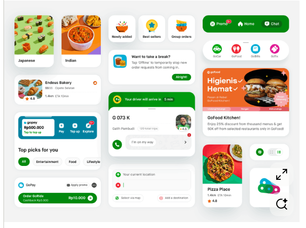

Kita akan mengubah total gaya visual aplikasi ini agar setara dengan UI modern seperti aplikasi GoFood/Gojek (berdasarkan referensi gambar baru). Gaya ini sangat bergantung pada "Extreme Rounded Corners", "Pill-shaped Buttons", dan "Generous Whitespace".

Tolong refactor komponen UI dengan aturan gaya (Style Guide) baru berikut:

1. BORDER RADIUS EKSTREM:
   - Semua Button (Tombol "Tambahkan", "Pesan Mandiri", dll) HARUS berbentuk "Pill-shape" (ujung membulat penuh seperti kapsul). Set border-radius ke nilai maksimal (misal: 50px).
   - Semua Card (Card Menu Makanan, Panel Keranjang) HARUS memiliki sudut membulat yang lebih besar dan halus (border-radius: 20px hingga 24px).

2. WARNA & SHADOW (BUBBLY AESTHETIC):
   - Tetap gunakan warna identitas Gacoan: Oranye Solid (#EA580C) untuk tombol/aksen utama. Jangan gunakan warna hijau dari referensi luar.
   - Background utama aplikasi gunakan warna abu-abu sangat terang (#F3F4F6) agar Card berwarna Putih Bersih (#FFFFFF) bisa menonjol.
   - Pertebal sedikit penyebaran efek drop shadow (blur radius dibesarkan, opacity diturunkan) agar card benar-benar terlihat empuk dan melayang (Bubbly/Antigravity).

3. PADDING & WHITESPACE (PENTING!):
   - Tambahkan internal padding yang jauh lebih besar di dalam Card Makanan dan Keranjang (misal: 20px - 24px).
   - Jangan ada elemen teks atau gambar yang menempel terlalu dekat dengan garis tepi card. Biarkan desainnya "bernapas".

4. KDS (Kitchen Display) JUGA DIUPDATE:
   - Terapkan konsep "Pill-shape" dan "Rounded Cards (24px)" ini juga ke panel antrean dan card pesanan di layar Dapur agar konsisten.

Tolong berikan update kode untuk merender bentuk pill-shape dan rounded card ini (override paintComponent jika menggunakan Swing murni, atau update CSS jika JavaFX).